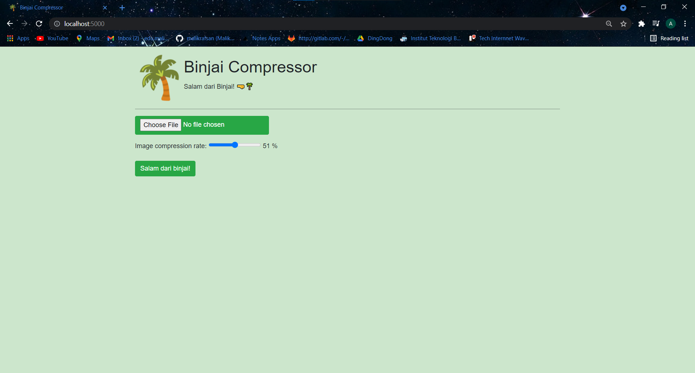
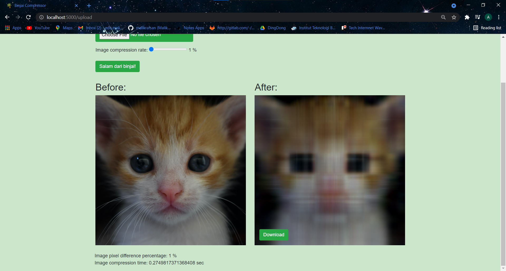
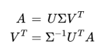
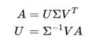

# Binjai Compressor

> This project is a website application for image compression that is developed for second major assignment of IF2123 Geometric and Linear Algebra course. This website uses Vanilla JavaScript for Frontend, Flask for Backend, Pillow for image extraction, and Numpy for matrix manipulation. You can access this website by host this website by following steps on the [Setup](#setup) and [How to Run](#how-to-run) or you can directly access it from this [site](http://malikrafsan.pythonanywhere.com/)

## Table of Contents

- [Binjai Compressor](#binjai-compressor)
  - [Table of Contents](#table-of-contents)
  - [Technologies Used](#technologies-used)
  - [Features](#features)
  - [Algorithm](#algorithm)
    - [Orthogonal Iteration](#orthogonal-iteration)
    - [SVD decomposition](#svd-decomposition)
    - [Read and Write Pictures](#read-and-write-pictures)
  - [Setup](#setup)
  - [How to Run](#how-to-run)
  - [References](#references)
  - [Developed by](#developed-by)

## Technologies Used

- Flask
- Numpy
- Pillow
- Vanilla JavaScript

## Features

- Upload image that will be compressed
- Specify rate of compression
- Download compressed image
- Information about compression duration



## Algorithm
### Orthogonal Iteration
In this part, in order to calculate eigenvalues and eigenvectors, we use NumPy module to multiply matrixs dan normalize them (QR Decomposition). Also, in this part, in order to adjust number of eigenvectors and eigenvalues, we ask user for input k. Broadly speaking, the description of its function is as follows:
  1. Initialize Q0 with a random value of size n x k, where n is the number of rows of the input matrix and k is the number of desired eigen pairs 
  2. Normalization of Q0 using QR decomposition
  3. Iterating with steps as follow:
    a. Multiplying dot A by Qi gives the example matrix Zi
    b. The decomposition of the Zi matrix gives Qi+1 and Ri+1
  4. Returns the last R diagonal and the last Q matrix

### SVD decomposition
In this function we combine it with compression because the function to get the eigenvector and eigenvalue is only what is needed. To process a matrix of size n x m we have 2 cases, namely when n < m and n m to speed up the process and not check all

For the case of n < m, we look for the U and matrices and then look for the VT matrix using the inverse method with the initial matrix.



As for the n m case, we look for the and VT matrices and then look for the U matrix using the inverse method with the initial matrix.



### Read and Write Pictures
In the process of reading the image from the input, we use PIL to process it and do the splitting based on the number of channels of the image, whether 3 channels (RGB for .jpg and the like) or 4 channels (RGBA for .png and the like). Before starting the process, we changed the data type from Uint8 (8 bit unsigned integer) to float so that it can be processed for compression. After passing through the compression, the RGB or RGBA values ​​will be converted back to Uint8 (after being limited between 0 to 255).

## Setup

Here, we provide `requirements.txt` which contains packages that are used in this project. But first you need to install `pipenv`

```
pip install pipenv
```

Then you need to open virtual environment

```
pipenv shell
```

After that, you can install all dependencies and packages that are used in this project.

```
pipenv install -r requirements.txt
```

## How to Run

You need to open virtual environment if you don't open it yet and then launch `flask_app.py`

```
pipenv shell
python src/flask_app.py
```

Note if you open this project using linux / mac / wsl, perhaps you need run these commands instead:

```
pipenv shell --python /usr/bin/python3
python src/flask_app.py
```

## References
- Strang, G. (2016).  Introduction to linear algebra. Cambridge Press. 
- Stephen Andrilli, David Hecker, in Elementary Linear Algebra (Fifth Edition), 2016
- Power iteration Page ID 623.  Accessed on http://mlwiki.org/index.php/Power_Iteration
- How to Flash Messages in Flask?. Accessed on https://www.askpython.com/python-modules/flask/flask-flash-method
- How to upload and download files using Flask. Accessed on https://www.codeunderscored.com/upload-download-files-flask/
- Form Validation with WTForms. Accessed on https://flask.palletsprojects.com/en/2.0.x/patterns/wtforms/
- Bootstrap Documentation. Accessed on
https://getbootstrap.com/docs/5.1/getting-started/introduction/

## Developed by

- 13520062 / Rifqi Naufal Abdjul
- 13520105 / Malik Akbar Hashemi Rafsanjani
- 13520122 / Alifia Rahmah
