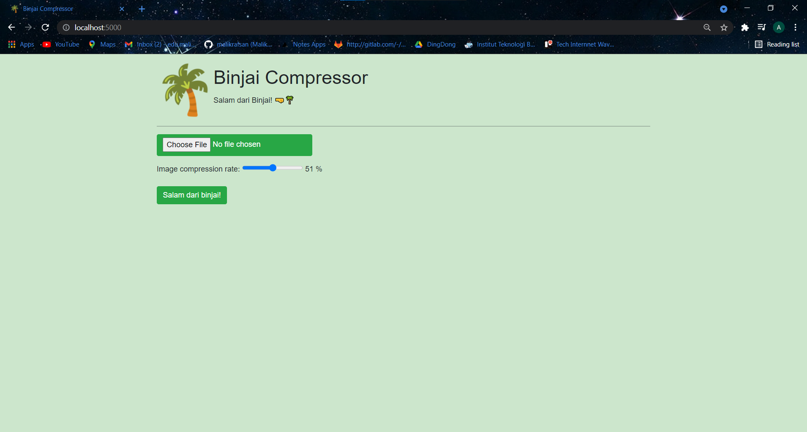

# Binjai Compressor

> This project is a website application for image compression that is developed for second major assignment of IF2123 Geometric and Linear Algebra course. This website uses Vanilla JavaScript for Frontend, Flask for Backend, Pillow for image extraction, and Numpy for matrix manipulation. You can access this website by host this website by following steps on the [Setup](#setup) and [How to Run](#how-to-run) or you can directly access it from this [site](http://malikrafsan.pythonanywhere.com/)

## Table of Contents
  - [Table of Contents](#table-of-contents)
  - [Technologies Used](#technologies-used)
  - [Features](#features)
  - [Setup](#setup)
  - [How to Run](#how-to-run)
  - [Developed by](#developed-by)

## Technologies Used
- Flask
- Numpy
- Pillow
- Vanilla JavaScript

## Features
- Upload image that will be compressed
- Specify rate of compression
- Download compressed image
- Information about compression duration



## Setup
Here, we provide `requirements.txt` which contains packages that are used in this project. But first you need to install `pipenv`
```
pip install pipenv
```
Then you need to open virtual environment
```
pipenv shell
```
After that, you can install all dependencies and packages that are used in this project.
```
pipenv install -r requirements.txt
```

## How to Run
You need to open virtual environment if you don't open it yet and then launch `flask_app.py`
```
pipenv shell
python flask_app.py
```
Note if you open this project using linux / mac / wsl, perhaps you need run these commands instead:
```
pipenv shell --python /usr/bin/python3
python flask_app.py
```

## Developed by
- 13520062 / Rifqi Naufal Abdjul 
- 13520105 / Malik Akbar Hashemi Rafsanjani
- 13520122 / Alifia Rahmah